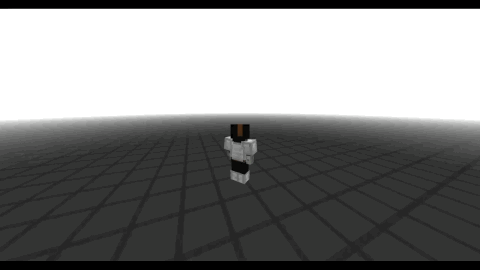

# Smooth Sneak Client



Client-only Forge mod for Minecraft 1.8.9 that smooths the third-person sneak
render animation. It does not change movement, hitboxes, packets, sneak state or
first-person rendering.

## Configuration

Use the client-side chat command:

```text
/sneaking
```

The same values are saved to:

```text
config/smoothsneakclient.cfg
```

## Build

Install a full JDK 8, then run:

```bash
./gradlew build
```

The built mod jar will be in:

```text
build/libs/smooth-sneak-client-1.8.9-1.1.0.jar
```

Put that jar only into the client `mods` folder. It is marked client-side only
and is intended to work on multiplayer servers without requiring server install.

## License

Copyright (c) 2026 Myffy. All rights reserved.

This project is proprietary and may not be used, copied, modified, or
redistributed without prior written permission.
